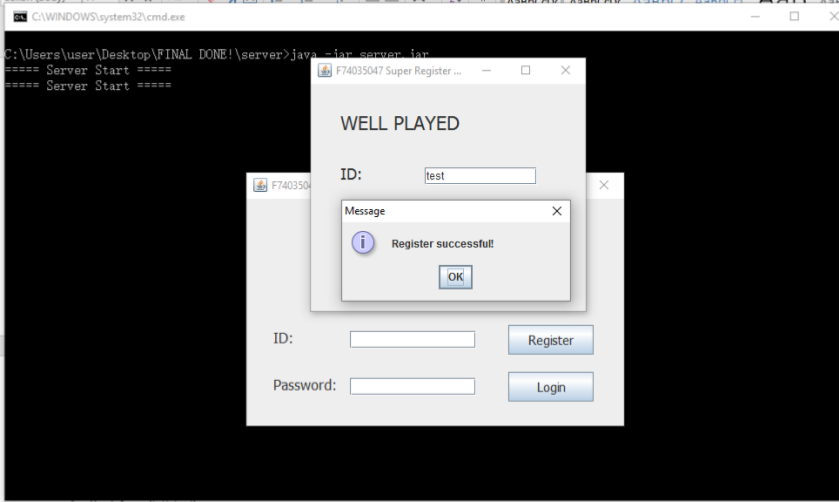

# Cloud Storage System With Encryption & Decrption

This is a virtual cloud storage system, every files and data stored in server is encrypted.
Each user could only download their own file and decrypt it.

## Server execution

## Client execution

### Login Screen

### Register Screen

### Client program screen

After uploaded a file named "a.txt"

